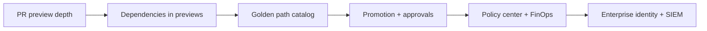

# Launchpad Enterprise Roadmap

Strategic features and changes to drive company adoption.

---

## Executive summary

Launchpad already unifies ephemeral previews, multi-cloud IaC workspaces, manifest deploy, GitHub App integration, org RBAC, OIDC SSO, audit logs, cost caps, drift scanning, and Dockerfile/CI scaffolding. The gap for company adoption is **enterprise trust, golden paths, and workflow depth**—not more isolated features.

## Current strengths

- Unified preview + IaC provision + manifest deploy in one portal
- Local kind → cloud promotion path for incremental adoption
- Governance: namespace quotas, network policies, TTL, soft cost caps
- GitHub App: PR comments, commit status, webhook rebuilds
- OIDC SSO with group→role mapping and org invites
- Audit logs, drift scanning, Dockerfile tooling, workspace IDE + terminal
- Multi-cloud: GCP, AWS, Azure, Cloudflare, and local kind

## Enterprise adoption blockers

| Area | You have | Companies expect |
|------|----------|------------------|
| Identity | OIDC + group→role | SAML + SCIM, enforced MFA via IdP |
| Governance | Quotas, TTL, cost caps | Kyverno/OPA policy packs, prod approval gates |
| Secrets | Session-injected creds | Vault / cloud SM + External Secrets |
| Audit | Per-environment audit API | Org-wide export, retention, SIEM integration |
| Isolation | Namespace governance | Dedicated clusters/cells per team or env class |
| Reliability | OCI deploy pack | HA reference arch, backup/restore, SLO monitoring |

Without these, platform teams treat Launchpad as a dev toy—not something for 200+ engineers.

---

## High-impact differentiators

### 1. PR-native preview environments

Your killer wedge. Extend GitHub integration beyond comments and commit status:

- Stable preview URL per PR (e.g. `pr-42.preview.company.com`)
- Auto smoke test against preview URL before marking status green
- “Open in Launchpad” deep link from GitHub Checks
- Auto-destroy on PR merge/close
- Optional: post screenshot or Lighthouse score to the PR

Developers feel this daily. Backstage catalogs don’t do previews; many preview tools don’t do IaC.

### 2. Golden path service catalog

Evolve catalog templates into org-approved service definitions:

- Service definitions with owner, tier, SLO, runbook, on-call
- Scorecards: Dockerfile, CI, monitoring, drift-free
- One-click **Create service** → repo + Dockerfile + CI + K8s + workspace
- Template versioning; org-approved stacks only

Position as: Backstage catalog + preview environments + Terraform generation in one product.

### 3. Dependency-aware previews

Preview envs that only deploy the app feel hollow:

- Ephemeral Postgres/Redis (operator or Helm subchart)
- DB seed from fixture or snapshot
- Internal DNS so `api` and `web` preview together
- Preview stack from monorepo path filters

Major gap vs Okteto/Humanitec—compelling for real production-like apps.

### 4. Promotion pipeline with approvals

Extend `promote_environment_to_cloud` into a governed path:

- `preview (PR)` → `staging (auto on merge)` → `production (manual approval)`
- GitHub Environment protection rules generated by Launchpad
- Approval UI + audit who approved
- Diff of manifest/IaC between stages; rollback to known-good revision

Companies buy **controlled change**—not just fast deploys.

### 5. FinOps that finance understands

Extend hourly/accrued cost and soft caps:

- Cost per team/project/service
- Budget alerts in Slack
- Estimated cost before launch on the Launch page
- Idle detection: pause envs with no traffic for 24h
- Monthly export for cloud billing reconciliation

Platform teams must justify the tool to finance.

### 6. Policy-as-code center

Turn governance into an org admin UI:

- No `hostPath`, no `privileged`, require `runAsNonRoot`
- Block deploy if Trivy/SAST exceeds org threshold
- Required labels/annotations on all workloads
- Exceptions with expiry and approver

Sell **governed self-service**—the phrase enterprise buyers use.

### 7. Platform engineering dashboard

Control tower for the internal platform team:

- Active previews, median time-to-ready, failure rate
- Top failing repos / templates
- Drift count by workspace
- DORA-style metrics and budget leaderboard

Makes Launchpad the operational hub—not just a launch button.

---

## Workflow integrations

- **Slack/Teams:** env ready, failed, TTL expiring, budget exceeded
- **Jira/Linear:** link preview URL to ticket; auto-comment on issue
- **PagerDuty/Opsgenie:** service catalog ties to on-call
- **Datadog/New Relic:** auto-inject tracing env vars in preview manifests

Each integration is a checkbox on an enterprise RFP.

## Production-ready polish

- Custom domains + TLS for previews
- Environment sharing with scoped reviewer access
- Read-only mode for auditors
- Public API + Terraform provider for `launchpad_environment` resources
- White-label: org logo, custom docs, branded status pages
- Multi-region: launch preview closest to reviewer

---

## Suggested roadmap

| Phase | Timeline | Deliverables |
|-------|----------|--------------|
| Phase 1 | 3–6 weeks | PR preview URLs, auto-destroy on PR close, smoke-test gate, Slack notifications |
| Phase 2 | 6–10 weeks | Service catalog + software templates, ephemeral DB/redis, cost-before-launch |
| Phase 3 | 10–16 weeks | Staging/prod promotion with approvals, policy UI, org audit export |
| Phase 4 | Ongoing | SCIM, Vault integration, HA multi-tenant deployment, Terraform provider |

---

## Competitive positioning

| Competitor | Their strength | Your angle |
|------------|----------------|------------|
| Backstage | Catalog, plugins | Ship previews and infra—not just docs |
| Humanitec / Qovery | Orchestration, dependencies | Multi-cloud IaC + previews without vendor lock-in |
| Okteto / DevPod | Dev environments | Governed previews + prod promotion path |
| Porter / Coherence | PaaS simplicity | Bring your cloud; we generate Terraform/Pulumi |

## Strategic choice

Pick your primary buyer:

1. **Platform engineering** → catalog, policy, FinOps, SIEM, promotion pipelines
2. **Product engineering** → PR previews, dependencies, GitHub UX

Lead with PR previews + golden paths for adoption; add policy + FinOps + identity for enterprise contracts.

**Unique combo:** local kind → cloud workspace → manifest deploy → ephemeral preview → promote, all governed. Almost no competitor does this end-to-end in one portal.
