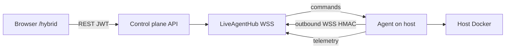

# Hybrid Cloud

Launchpad **Hybrid Cloud** lets you treat public cloud accounts and self-hosted hosts (homelab, edge, on-prem VMs) as first-class deployment targets from one portal.

Open the UI at **`/hybrid`** (nav: **Hybrid Cloud**).

## What problem it solves

| Without Hybrid | With Hybrid |
| --- | --- |
| Public cloud only (GCP / AWS / Azure) via IaC workspaces | Same portal can also push containers to a machine you own |
| Homelab hosts need inbound ports / VPN / bastion for the control plane to reach them | Agent dials **outbound** WebSocket (WSS); no public IP required |
| Manual `docker run` on each box | Enroll once, then deploy from the dashboard or AI blueprint |

Hybrid does **not** replace Environments (git previews on Kubernetes) or Provision (Terraform/Pulumi). It adds a third deployment surface: **agent nodes** plus an **AI Infrastructure Provisioner** that can target those nodes or cloud.

## Concepts

### Control plane

The Launchpad API (`apps/api`) stores enrolled nodes, issues install tokens, hosts the agent WebSocket hub, and runs the AI blueprint generator.

### Agent node

A Linux host with Docker that runs the Launchpad agent (`agent/`). The agent:

1. Registers with a one-time enrollment token
2. Stores a durable per-node HMAC secret locally
3. Keeps an outbound tunnel open to the control plane
4. Sends heartbeats (CPU, RAM, disk, Docker status, containers)
5. Executes commands (pull / run / stop / restart / logs)

### AI Infrastructure Provisioner

On `/hybrid`, describe a stack in natural language. Launchpad builds a guardrailed **blueprint** (Gemini when `GEMINI_API_KEY` is set, otherwise a heuristic). You can deploy that blueprint to:

- An **online** homelab node (Docker run specs over the tunnel)
- **GCP / AWS / Azure** (maps into the existing Provision / IaC path)

Guardrails cap local-node CPU and memory (`AGENT_LOCAL_NODE_MAX_VCPU`, `AGENT_LOCAL_NODE_MAX_MEMORY_MB`).

## Architecture



Security highlights:

- Agent never opens inbound ports
- Auth is **per-node HMAC**, not a user JWT
- Enrollment tokens (`lp_…`) are single-use and short-lived
- Revoking a node in the UI disconnects the tunnel and invalidates the secret

## Operator walkthrough

### 1. Enroll a node

1. Sign in to Launchpad and open **Hybrid Cloud** (`/hybrid`).
2. Under **Deployment nodes**, click **Enroll node**, give it a name (for example `homelab-nas`).
3. Copy the one-line install command. The raw token is shown **once**.

Example shape:

```bash
curl -sSL https://<control-plane>/install.sh | TOKEN=lp_xxx sh
```

Requirements on the host: Docker on `PATH`, outbound HTTPS/WSS to the control plane.

### 2. Confirm online

After install, the node should move **Pending → Online**. Telemetry refreshes about every 10 seconds (`AGENT_HEARTBEAT_INTERVAL_SECONDS`). A node is treated offline if no heartbeat arrives within ~35 seconds (`AGENT_OFFLINE_AFTER_SECONDS`).

### 3. Deploy with AI (optional)

1. In **AI Infrastructure Provisioner**, describe the stack.
2. Choose target: **Homelab node** (pick an online node) or a cloud provider.
3. **Generate blueprint** → review services, guardrails, and cost estimate.
4. **Deploy** → for a node, the control plane sends Docker commands over the tunnel; for cloud, follow the IaC / Provision flow.

### 4. Revoke

**Revoke** on a node card drops the live connection and prevents further agent use of that secret.

## Control-plane configuration

Set these on the API (see `apps/api/.env.example` / Settings):

| Variable | Purpose |
| --- | --- |
| `AGENT_CONTROL_PLANE_URL` | Public API origin agents call (must reach `/install.sh` and `/api/v1/...`) |
| `AGENT_WS_PUBLIC_URL` | Optional explicit `wss://` origin if WS is on a different host |
| `AGENT_IMAGE` | Agent container image (default `ghcr.io/launchpad/agent:latest`) |
| `AGENT_ENROLLMENT_TTL_SECONDS` | Install token lifetime (default 900) |
| `AGENT_HEARTBEAT_INTERVAL_SECONDS` | Expected heartbeat cadence (default 10) |
| `AGENT_OFFLINE_AFTER_SECONDS` | Offline threshold (default 35) |
| `AGENT_COMMAND_TIMEOUT_SECONDS` | Per-command wait (default 30) |
| `AGENT_LOCAL_NODE_MAX_VCPU` / `AGENT_LOCAL_NODE_MAX_MEMORY_MB` | AI guardrail caps for local deploys |
| `GEMINI_API_KEY` / `GEMINI_MODEL` | Optional; enables Gemini blueprints |
| `AI_PROVISIONER_HEURISTIC_FALLBACK` | Keep heuristic mode when Gemini is unset (default true) |

Local tip: if the UI is on `:3000` and the API on `:8000`, set `AGENT_CONTROL_PLANE_URL=http://localhost:8000` (or your LAN IP) so agents hit the API, not the Nuxt origin.

## Developer references

| Area | Location |
| --- | --- |
| Agent daemon | [`agent/`](../agent/) ([README](../agent/README.md)) |
| Node registry + WSS hub | `apps/api/app/services/node_registry.py` |
| Install script / bundle | `apps/api/app/services/agent_install.py` |
| REST + WebSocket routes | `apps/api/app/routers/nodes.py` |
| AI provisioner | `apps/api/app/services/ai_provisioner.py` |
| UI | `/hybrid`, `HybridProvisioner`, `NodeFleetPanel`, `AiProvisionerPanel` |
| Product guide | In-app **Docs** → Hybrid Cloud |
| Technical notes | `/bibirinbuluaremieye/technical/hybrid` |

## How Hybrid relates to other Launchpad flows

```text
Environments  →  ephemeral app previews on Kubernetes (kind / cloud)
Provision     →  generate + apply Terraform/Pulumi cloud infra
Hybrid Cloud  →  enroll self-hosted nodes + AI blueprints to node or cloud
```

You can still use Provision for golden-path cloud stacks, and Hybrid when you want the same UX against a machine behind NAT.
